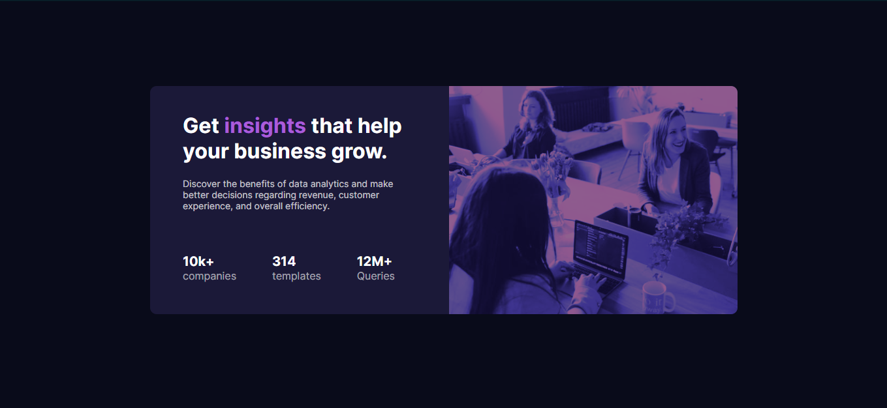

<h1 align="center">
    
    FrontendMentor
</h1>

<h1> 
    
</h1>
<h3 align="center">
    <a href="https://lyppeh.github.io/StatsPreviewCard/">Acesar a demonstração</a>
</h3>


## 📖 Sobre

O projeto foi desenvolvido através de um desafio do <a href="https://www.frontendmentor.io/challenges/stats-preview-card-component-8JqbgoU62">**FrontendMentor**</a>, aonde eles passaram os designs e o style que a página deveria seguir.

## 🛠️ Tecnologias utilizadas

- HTML5
- CSS3
- Visual Studio Code

## 💾 Como baixar o projeto

```bash
# clonar com https
$ git clone https://github.com/Lyppeh/StatsPreviewCard.git

#clonar com ssh
$ git clone git@github.com:Lyppeh/StatsPreviewCard.git
```

### 💻 desenvolvidor por:
✔ Fellype Nascimento

[](https://github.com/Lyppeh)
[](https://www.linkedin.com/in/fellypenascimentodev/)
[](mailto:fellypemnascimento@gmail.com)


